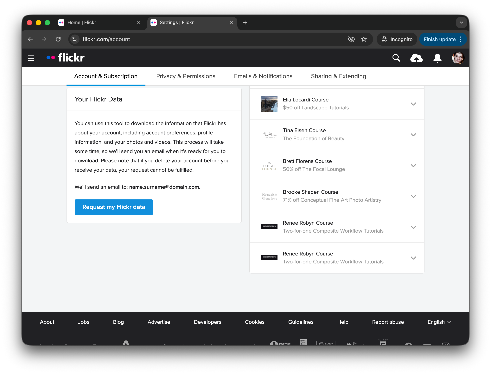
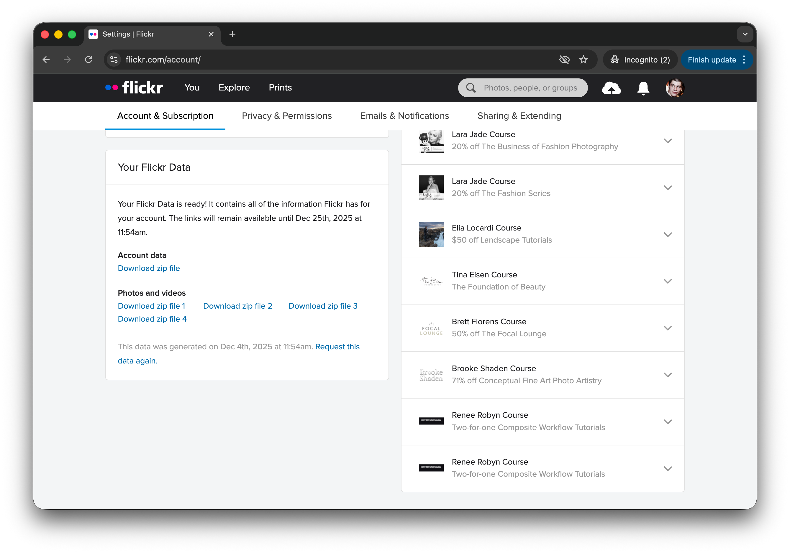

# Transfer Flickr pics to Apple's Photos app

Embed Flickr metadata (titles, descriptions, tags, albums, GPS) into photos to be imported into Apple's Photos.

**Note**: Flickr Pro account is needed to download your data.

## Step 1: Request your data from Flickr

Go to your Flickr account ([flickr.com/account](https://www.flickr.com/account)) and click on the "Request my Flickr data".

After a few minutes, you'll receive an email that your data is available for download:

You'll get several zip files: one with your account and photos info (metadata), and others with your photos.

## Step 2: Organize your files

Create two folders: **data** and **images**.

- Unzip account data into `data/` folder (contains JSON files with metadata, e.g. `albums.json`, `photo_{id}.json`, etc.)
- Unzip photo files (`data-download-1.zip`, etc.) into `images/` folder (photos named `{title}_{id}_o.jpg`)

## Step 3: Prerequisites

1. Install Node.js: `brew install node` (or download from [nodejs.org](https://nodejs.org/))
2. Install ExifTool: `brew install exiftool`

## Step 4: Run the script

Run `node add-metadata.js` to embed metadata into images. Enhanced images will be saved to `flickr/` folder.

## Step 5: Import to Apple Photos

Open Apple Photos → "File" → "Import" → select your `flickr/` folder. Enable "Keep folders" to create albums from folder structure.

**Note**: Albums will appear nested (e.g., `flickr/Portraits/Portraits`). You can drag albums to reorganize them.